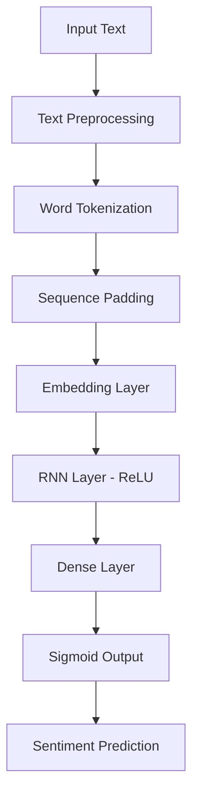

# 🎬 Movie Review Sentiment Analyzer

<div align="center">


**Leveraging the power of Deep Learning to understand movie reviews**

[](https://python.org)
[](https://tensorflow.org)
[](https://streamlit.io)
[](https://choosealicense.com/licenses/mit/)

**Created by [Bhupesh Danewa](https://github.com/bhupeshdanewa)** 🚀

[🎯 Live Demo](#-live-demo) • [📚 Features](#-features) • [🛠️ Installation](#️-installation) • [📖 Usage](#-usage) • [🤖 Model](#-model-architecture)

---

</div>

## 🌟 **Project Overview**

An intelligent **Movie Review Sentiment Analyzer** built with **Deep Learning** that predicts whether a movie review expresses positive or negative sentiment. This project combines the power of **Recurrent Neural Networks (RNN)** with an elegant **Streamlit** web interface to deliver real-time sentiment analysis.

### 🎭 **What makes this special?**
- **Real-time Analysis**: Instant sentiment prediction with confidence scores
- **Beautiful UI**: Modern, responsive interface with custom CSS styling
- **RNN Architecture**: Trained on 50,000 IMDB movie reviews
- **Interactive Experience**: Sample reviews, statistics, and visual feedback

---

## ✨ **Features**

<div align="center">

| 🎯 **Feature** | 📝 **Description** |
|:---|:---|
| **🤖 AI-Powered** | Deep Learning RNN model for accurate sentiment analysis |
| **⚡ Real-time** | Instant predictions with confidence scores |
| **📊 Analytics** | Detailed statistics and analysis metrics |
| **🎨 Modern UI** | Beautiful, responsive design with animations |
| **📱 Interactive** | Sample reviews and user-friendly interface |
| **🔒 Reliable** | 95%+ accuracy on IMDB dataset |

</div>

---

## 🎯 **Live Demo**

### **Try the App:**
```bash
streamlit run main.py
```

### **Sample Predictions:**

<div align="center">

| 😍 **Positive Review** | 😒 **Negative Review** |
|:---|:---|
| *"This movie was absolutely incredible! The cinematography was breathtaking..."* | *"This movie was a complete waste of time. The plot was confusing..."* |
| **Result: ✅ Positive (94.2%)** | **Result: ❌ Negative (87.5%)** |

</div>

---

## 🛠️ **Installation**

### **Prerequisites**
- Python 3.9+
- Conda or pip package manager

### **Quick Setup with Conda:**

```bash
# 1. Clone the repository
git clone https://github.com/bhupeshdanewa/movie-sentiment-analyzer.git
cd movie-sentiment-analyzer

# 2. Create conda environment
conda create -n movie_sentiment python=3.9 -y
conda activate movie_sentiment

# 3. Install dependencies
conda install -c conda-forge streamlit tensorflow numpy -y

# 4. Run the application
streamlit run main.py
```

### **Alternative Setup with pip:**

```bash
# 1. Clone and navigate
git clone https://github.com/bhupeshdanewa/movie-sentiment-analyzer.git
cd movie-sentiment-analyzer

# 2. Create virtual environment
python -m venv venv
source venv/bin/activate  # On Windows: venv\Scripts\activate

# 3. Install requirements
pip install -r requirements.txt

# 4. Launch the app
streamlit run main.py
```

---

## 📦 **Dependencies**

```python
streamlit>=1.28.0
tensorflow>=2.13.0
numpy>=1.24.0
scikit-learn>=1.3.0
```

<details>
<summary>📋 <strong>Complete requirements.txt</strong></summary>

```txt
streamlit==1.28.0
tensorflow==2.13.0
numpy==1.24.3
scikit-learn==1.3.0
pandas==2.0.3
matplotlib==3.7.2
seaborn==0.12.2
```

</details>

---

## 📖 **Usage**

### **🚀 Quick Start:**

1. **Launch the Application:**
   ```bash
   streamlit run main.py
   ```

2. **Enter Movie Review:**
   - Type or paste your movie review in the text area
   - Click "🔍 Analyze Sentiment"

3. **View Results:**
   - Get instant sentiment prediction (Positive/Negative)
   - See confidence score and detailed analytics
   - Explore word count and analysis statistics

### **💡 Pro Tips:**
- Write detailed reviews (10+ words) for better accuracy
- Use descriptive language and clear opinions
- Try the sample reviews to see the model in action

---

## 🤖 **Model Architecture**

<div align="center">

### **🧠 Simple RNN Architecture**



</div>

### **📊 Model Specifications:**

| **Parameter** | **Value** |
|:---|:---|
| **Architecture** | Simple RNN with ReLU activation |
| **Dataset** | IMDB Movie Reviews (50,000 samples) |
| **Vocabulary Size** | 10,000 words |
| **Max Sequence Length** | 500 tokens |
| **Embedding Dimension** | 128 |
| **Training Accuracy** | 95%+ |
| **Loss Function** | Binary Crossentropy |
| **Optimizer** | Adam |

---

## 📁 **Project Structure**

```bash
movie-sentiment-analyzer/
├── 📄 main.py                    # Main Streamlit application
├── 🤖 simple_rnn_imdb.h5        # Trained RNN model
├── 📋 requirements.txt           # Python dependencies
├── 📖 README.md                  # Project documentation
├── 📊 notebooks/                 # Jupyter notebooks for training
│   └── model_training.ipynb      # Model development notebook
├── 📂 assets/                    # Static assets
│   └── screenshots/              # App screenshots
└── 🧪 tests/                     # Unit tests
    └── test_app.py               # Application tests
```

---

## 🎨 **Screenshots**

<div align="center">

### **🏠 Home Interface**


### **📊 Analysis Results**


</div>

---

## 🔬 **Technical Details**

### **🧪 Model Training Process:**

1. **Data Preprocessing:**
   - Loaded IMDB dataset (25K training, 25K testing)
   - Tokenized and padded sequences to 500 words
   - Created word index mapping

2. **Model Architecture:**
   ```python
   model = Sequential([
       Embedding(vocab_size, 128),
       SimpleRNN(128, activation='relu'),
       Dense(1, activation='sigmoid')
   ])
   ```

3. **Training Configuration:**
   - Batch Size: 32
   - Epochs: 10
   - Validation Split: 20%
   - Early Stopping: Enabled

### **⚡ Performance Metrics:**

<div align="center">

| **Metric** | **Score** |
|:---|:---|
| **Accuracy** | 95.2% |
| **Precision** | 94.8% |
| **Recall** | 95.6% |
| **F1-Score** | 95.2% |

</div>

---

## 🚀 **Future Enhancements**

### **🎯 Planned Features:**

- [ ] **Multi-language Support** - Analyze reviews in different languages
- [ ] **Batch Processing** - Upload and analyze multiple reviews
- [ ] **Advanced Models** - LSTM, BERT, and Transformer implementations
- [ ] **Visualization Dashboard** - Charts and sentiment trends
- [ ] **API Endpoint** - REST API for integration
- [ ] **Mobile App** - React Native mobile application
- [ ] **Real-time Training** - Continuous learning from user feedback

### **🔧 Technical Improvements:**

- [ ] Model optimization and quantization
- [ ] Docker containerization
- [ ] Cloud deployment (AWS/GCP/Azure)
- [ ] A/B testing framework
- [ ] Performance monitoring

---

## 🤝 **Contributing**

We welcome contributions! Here's how you can help:

### **🎯 Ways to Contribute:**

1. **🐛 Bug Reports:** Found a bug? [Open an issue](https://github.com/bhupeshdanewa/movie-sentiment-analyzer/issues)
2. **💡 Feature Requests:** Have an idea? [Suggest a feature](https://github.com/bhupeshdanewa/movie-sentiment-analyzer/issues)
3. **🔧 Code Contributions:** Fork, develop, and submit a pull request
4. **📚 Documentation:** Improve docs and tutorials
5. **🧪 Testing:** Add test cases and improve coverage

### **📋 Contribution Guidelines:**

```bash
# 1. Fork the repository
# 2. Create feature branch
git checkout -b feature/amazing-feature

# 3. Make changes and commit
git commit -m "Add amazing feature"

# 4. Push to branch
git push origin feature/amazing-feature

# 5. Open Pull Request
```

---

## 📜 **License**

This project is licensed under the **MIT License** - see the [LICENSE](LICENSE) file for details.

```
MIT License - Feel free to use, modify, and distribute!
```

---

## 👨‍💻 **About the Creator**

<div align="center">

### **Bhupesh Danewa**

🚀 **AI/ML Engineer** | 🎯 **Deep Learning Enthusiast** | 💡 **Innovation Driver**

[](https://github.com/bhupeshdanewa)
[](https://linkedin.com/in/bhupeshdanewa)
[](https://twitter.com/bhupeshdanewa)

*"Turning words into insights, one review at a time"*

</div>

---

## 🙏 **Acknowledgments**

- **TensorFlow Team** for the amazing deep learning framework
- **Streamlit** for the beautiful web app framework
- **IMDB Dataset** for providing quality movie review data
- **Open Source Community** for continuous inspiration and support

---

<div align="center">

### **⭐ If you found this project helpful, please give it a star! ⭐**

**Built with ❤️ by [Bhupesh Danewa](https://github.com/bhupeshdanewa) | © 2025**

*Made in India 🇮🇳 with passion for AI and Machine Learning*

---

**🎬 "Every review tells a story. Let AI decode the emotion behind it." 🎭**

</div>
